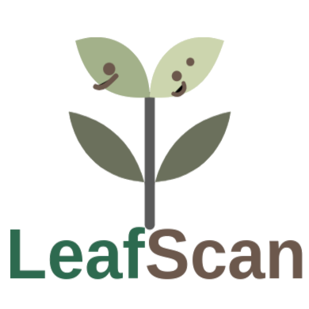

# 🌿 LeafScan - Plant Disease Diagnostic System



**LeafScan** is an AI-powered plant disease diagnostic tool that helps gardeners, farmers, and plant enthusiasts identify and treat plant diseases quickly and accurately. The system combines machine learning, expert knowledge, and an easy-to-use web interface to provide instant, reliable diagnosis and treatment suggestions.


## 🚀 Features

- ✅ Upload leaf images for AI-powered disease diagnosis  
- 📋 Dropdown selection for expert knowledge-based diagnosis  
- 🧠 Visual analytics and history of diagnoses  
- 💡 Disease treatment suggestions  
- 🌐 Flask-based web application


## 📦 Installation and Setup

Follow the steps below to run the LeafScan application locally.

### 1. Fork or Clone the Repository

To contribute, **fork** the repository and then clone your fork:

```bash
git clone https://github.com/YOUR-USERNAME/leafscan.git
cd leafscan
```

If you're not contributing back, clone directly:

```bash
git clone https://github.com/ORIGINAL-AUTHOR/leafscan.git
cd leafscan
```


### 2. Create a Python Virtual Environment

It's best to isolate dependencies using `venv`:

```bash
# Create virtual environment
python3 -m venv venv

# Activate on Linux/macOS
source venv/bin/activate

# Activate on Windows
venv\Scripts\activate
```


### 3. Install Python Dependencies

Install required packages using:

```bash
pip install -r requirements.txt
```


### 4. Run the Flask Application

Start the server with:

```bash
python main.py
```

Visit the app in your browser at:

```
https://127.0.0.1:9923
```


## 🛠️ Project Structure

```
leafscan/
├── app
│   ├── __init__.py
│   ├── logic.py
│   ├── routes.py
│   ├── static/
│   └── templates/
├── config.py
├── image.png
├── LICENSE
├── main.py
├── README.md
├── requirements.txt
├── ssl_cert/
│   ├── cert.pem
│   └── key.pem
└── venv/
    ├── bin
    ├── include
    ├── lib
    ├── lib64 -> lib
    └── pyvenv.cfg

```

---

## 🌱 Contributing to LeafScan

We welcome contributions! Here's how:

1. **Fork** this repository  
2. **Clone** your fork  
3. Create a new branch:
   ```bash
   git checkout -b feature/your-feature-name
   ```
4. Make your changes and commit:
   ```bash
   git add .
   git commit -m "Descriptive commit message"
   ```
5. Push to your fork:
   ```bash
   git push origin feature/your-feature-name
   ```
6. Open a **Pull Request** on the main repository

---

## 🧠 Technologies Used

- Python 3  
- Flask  
- OpenCV  
- TensorFlow/Keras or PyTorch  
- HTML, CSS, JavaScript

---

## 📜 License

This project is licensed under the [BSD 3-Clause License](LICENSE).


## 👩‍💻 Maintainer

Developed and maintained by [imosudi](https://github.com/imosudi).  
Inspired by the need for smart, AI-based tools in agriculture and plant care.

---
